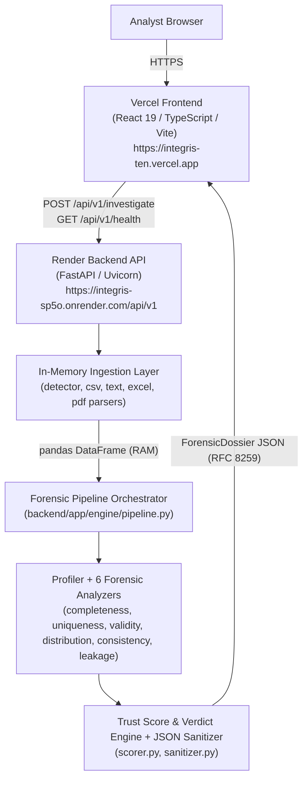
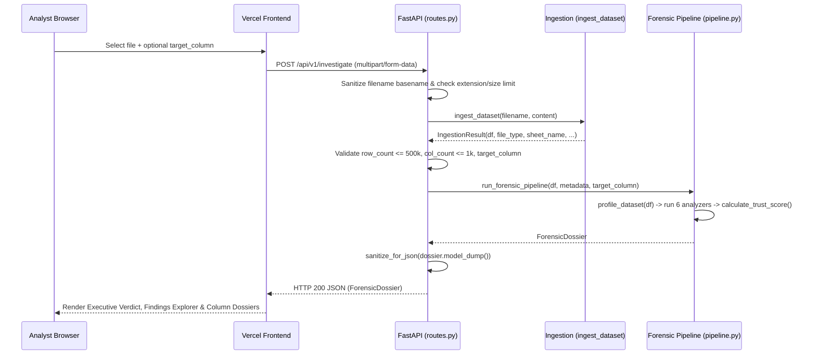

# INTEGRIS — Technical Architecture

This document describes the system architecture, component responsibilities, data flow, and operational boundaries of the **INTEGRIS — Data Integrity & Forensics Platform** at production baseline `4558912`.

---

## 1. System Overview

INTEGRIS is a stateless, two-tier web application that performs deterministic forensic analysis on uploaded tabular datasets. The system is divided into:

1. **Investigation Frontend (`frontend/`):** A React 19 + TypeScript single-page application deployed on Vercel (`https://integris-ten.vercel.app`) that handles file selection, client-side header previewing, investigation configuration, interactive result exploration, and report export.
2. **Forensic API & Engine (`backend/`):** A FastAPI + Python service deployed on Render (`https://integris-sp5o.onrender.com`) that validates uploads, parses six tabular/document formats in volatile memory, runs the forensic analysis pipeline, and returns a strongly typed `ForensicDossier` JSON response.

---

## 2. Frontend Responsibilities

Located in `frontend/src/`, the frontend is strictly a presentation and investigation interface—it performs no statistical or forensic computation itself:

- **Upload & Pre-Flight Inspection (`components/upload/DatasetUploader.tsx`):**
  - Validates file extension (`.csv`, `.tsv`, `.txt`, `.xlsx`, `.xls`, `.pdf`) and format-specific byte limits before upload.
  - Samples the first `64 KB` of text-based files (`.csv`, `.tsv`, `.txt`) in the browser to populate an optional `target_column` dropdown; renders a text input fallback for binary formats (`.xlsx`, `.xls`, `.pdf`).
- **API Client (`services/api.ts`):**
  - Resolves `VITE_API_BASE_URL` (defaulting to `/api/v1` in local proxy mode and `https://integris-sp5o.onrender.com/api/v1` in production).
  - Sends `multipart/form-data` requests to `POST /api/v1/investigate` and surfaces structured HTTP `400`, `413`, `422`, and `500` error details.
- **Investigation Workspace (`components/investigation/`):**
  - `ExecutiveVerdictCard.tsx`: Displays the composite `0.0–100.0` Trust Score, letter grade (`A+` to `F`), executive verdict (`RELIABLE`, `CAUTION`, `COMPROMISED`), rationale, and severity counts.
  - `TrustScoreBreakdown.tsx`: Renders the itemized penalty ledger (`PenaltyItem[]`) and category impact bars.
  - `FindingsExplorer.tsx`: Provides severity, category, and full-text filtering over `Finding[]` cards, plus column-tag filter triggers.
  - `FindingDetailDrawer.tsx`: Slide-out drawer displaying quantified `Evidence[]`, sample row indices, offending values, and `Recommendation[]` actions.
  - `ColumnDossiers.tsx`: Filterable per-column cards (`ColumnProfile[]`) showing inferred dtype, semantic type, null/unique ratios, sample values, and numeric summary statistics.
- **Dossier Export (`utils/reportGenerator.ts`, `components/report/ReportPreviewModal.tsx`):**
  - Generates a 9-section Markdown audit report (`.md`), a raw `ForensicDossier` JSON export (`.json`), and a print-formatted report (`@media print` in `index.css`).

---

## 3. Backend / API Responsibilities

Located in `backend/app/`, the backend exposes a stateless HTTP interface and enforces security and structural boundaries:

- **Application & Middleware (`main.py`):**
  - Configures `CORSMiddleware` with explicit allowed origins (`https://integris-ten.vercel.app` and local dev ports) and an anchored preview regex (`^https://integris-ten(-[a-z0-9-]+)?\.vercel\.app$`).
  - Wraps all routes in `ErrorHandlerMiddleware`, which catches unhandled exceptions, verifies the request `Origin` via `re.fullmatch`, and returns a redacted HTTP `500` JSON response (`{"detail": "Forensic engine encountered an internal server error: <ExceptionType>."}`).
- **Endpoints (`api/routes.py`):**
  - `GET /` — Platform metadata descriptor.
  - `GET /api/v1/health` — Returns `HealthResponse` (`status: "healthy"`, `engine_status: "ready"`, version, and UTC timestamp).
  - `POST /api/v1/investigate` — Sanitizes `file.filename` to its basename via `PurePath`, enforces format-specific byte limits (`await file.read(max_bytes + 1)`), invokes `ingest_dataset()`, enforces row/column limits (`500,000` rows, `1,000` columns), validates `target_column` if provided (`HTTP 422` if missing), runs `run_forensic_pipeline()`, sanitizes non-finite floats via `sanitize_for_json()`, and returns the `ForensicDossier`.

---

## 4. Forensic Engine Responsibilities

Located in `backend/app/ ingestion/` and `backend/app/engine/`:

- **Ingestion Layer (`backend/app/ingestion/`):**
  - `detector.py`: Validates file extensions against magic bytes (`%PDF`, `PK\x03\x04`, `\xd0\xcf\x11\xe0\xa1\xb1\x1a\xe1`) and rejects binary null-byte streams masquerading as text.
  - `csv_parser.py` & `text_parser.py`: Decode `UTF-8-SIG` / `UTF-8` / `CP1252` / `Latin-1`, sniff delimiters (`,`, `\t`, `;`, `|`), reject unstructured prose, and preserve literal sentinel tokens (`keep_default_na=False`).
  - `excel_parser.py`: Enforces a `250 MB` uncompressed ZIP ceiling on `.xlsx` archives, selects the first non-empty worksheet in `.xlsx` (`openpyxl`) or `.xls` (`xlrd`), and preserves textual sentinels (`"N/A"`).
  - `pdf_parser.py`: Extracts vector tables via `pdfplumber`, coalesces multi-page tables with matching column counts while skipping repeated headers, retains single-row continuation pages, and rejects scanned/non-tabular PDFs.
- **Pipeline & Analyzers (`backend/app/engine/`):**
  - `profiler.py`: Deduplicates column headers (`col`, `col_1`), computes dataset-level summary counts, infers `SemanticType` per column, and computes numeric statistics over finite values.
  - `completeness.py`, `uniqueness.py`, `validity.py`, `distribution.py`, `consistency.py`, `leakage.py`: Execute deterministic checks and emit `Finding` objects.
  - `scorer.py`: Computes the `TrustScore` from deduplicated findings.
  - `sanitizer.py`: Recursively replaces `NaN`, `+Inf`, `-Inf`, `pd.NA`, and `pd.NaT` with `None` (`null`) while preserving `0` and `0.0`.

---

## 5. Investigation Flow

---

## 6. Finding Lifecycle

Each anomaly detected by an analyzer is represented as an immutable `Finding` (`backend/app/models/report.py`):

1. **Creation:** An analyzer identifies a rule or statistical violation and constructs a `Finding` with a deterministic ID (e.g., `FND-UNQ-PK-COLLISION-employee_id`, `FND-CNS-TEMP-hire_date-termination_date`), `FindingCategory`, `Severity`, `affected_columns`, `affected_row_count`, `affected_row_ratio`, one or more `Evidence` records (containing `metric_name`, `observed_value`, `threshold_or_expected`, up to 10 `sample_row_indices`, and representative `sample_values`), and a `Recommendation`.
2. **Deduplication & Ordering:** `run_forensic_pipeline()` deduplicates findings by `id` and sorts them by severity (`CRITICAL` → `HIGH` → `MEDIUM` → `LOW` → `INFO`).
3. **Column Attribution:** For every finding, `run_forensic_pipeline()` increments `anomalies_detected` on each affected `ColumnProfile`.
4. **Recommendation Aggregation:** Recommendations across all findings are collected and sorted by priority for top-level dossier consumption.

---

## 7. Scoring & Verdict Flow

`calculate_trust_score()` (`backend/app/engine/scorer.py`) converts the list of findings into a `TrustScore`:

1. **Baseline:** Starts at `100.0`.
2. **Base Severity Weights:** `CRITICAL = 20.0`, `HIGH = 12.0`, `MEDIUM = 6.0`, `LOW = 2.0`, `INFO = 0.0`.
3. **Row-Ratio Scaling:**
   - `CRITICAL` findings apply their full `20.0` base deduction regardless of row ratio.
   - Non-critical findings with `affected_row_ratio > 0` scale by `0.60 + 0.40 * min(1.0, affected_row_ratio * 2.0)` (between `60%` and `100%` of the base penalty).
4. **Per-Column Penalty Cap:** Each column has an accumulator capped at `MAX_PER_COLUMN_PENALTY = 35.0` points so a single corrupted column cannot deduct more than `35.0` points across multiple findings.
5. **Clamping & Verdict Mapping:** `overall_score = round(max(0.0, min(100.0, 100.0 - total_deductions)), 1)`:
   - `97.0–100.0`: Grade `A+`, Verdict `RELIABLE`
   - `90.0–96.9`: Grade `A`, Verdict `RELIABLE`
   - `75.0–89.9`: Grade `B`, Verdict `RELIABLE`
   - `50.0–74.9`: Grade `C`, Verdict `CAUTION`
   - `30.0–49.9`: Grade `D`, Verdict `CAUTION`
   - `0.0–29.9`: Grade `F`, Verdict `COMPROMISED`

---

## 8. Production Deployment

- **Frontend Hosting:** Deployed on **Vercel** (`https://integris-ten.vercel.app`) from `frontend/` using `frontend/vercel.json` (SPA rewrite to `/index.html`).
- **Backend Hosting:** Deployed on **Render** (`https://integris-sp5o.onrender.com`) from `backend/` as defined in `render.yaml` (`uvicorn app.main:app --host 0.0.0.0 --port $PORT`).
- **Inactive Infrastructure:** Google Cloud Run is not part of the production architecture.

---

## 9. Security Boundaries

- **Zero Disk / Database Persistence:** All file bytes (`bytes` / `io.BytesIO`) and pandas DataFrames exist only in request-scoped memory.
- **Strict Origin Boundary:** Only `https://integris-ten.vercel.app`, matching `integris-ten` preview domains, and localhost development ports receive `Access-Control-Allow-Origin` headers.
- **Input Validation Boundary:** Filenames are stripped to basenames; file sizes, magic bytes, ZIP decompression ratios, and DataFrame dimensions are checked prior to pipeline execution.
- **Output Boundary:** All responses pass through `sanitize_for_json()` to guarantee strict RFC 8259 JSON compliance, and unhandled server exceptions redact internal details.

---

## 10. Testing Strategy

- **Backend Unit & Integration (`backend/tests/`):** `111` pytest tests verifying each analyzer module, multi-format parsers, non-finite float sanitization, CORS origin enforcement, filename sanitization, and end-to-end API contracts.
- **Frontend Unit & Contract (`frontend/src/utils/reportGenerator.test.js`):** `6` Node test runner checks verifying byte/value formatting, JSON/Markdown dossier generation, and UI accessibility/responsive invariants.
- **Synthetic Corpus Validation (`backend/tests/validate_claude_corpus.py`):** Local validation harness exercising 119 synthetic multi-format datasets against manifest ground truth.
